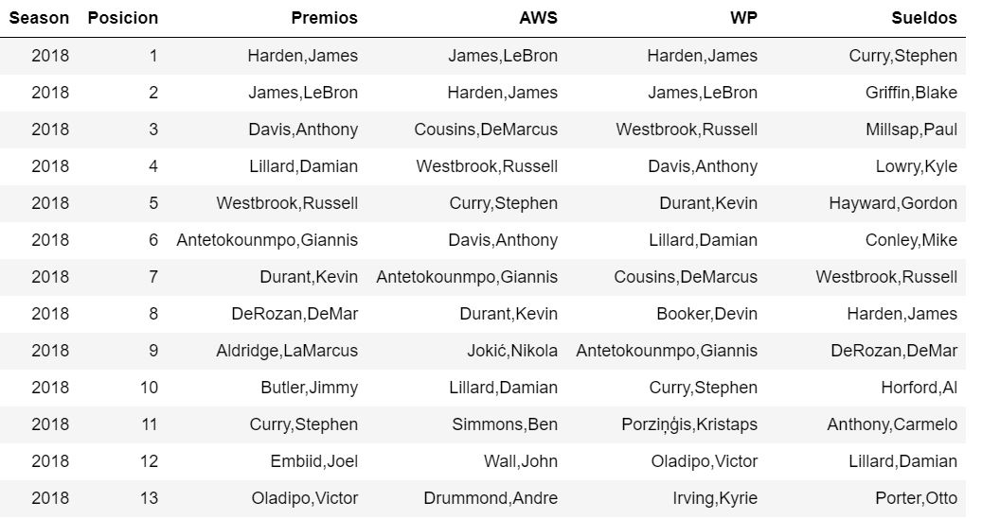
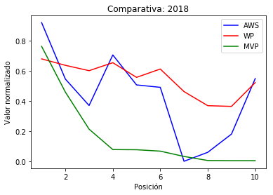
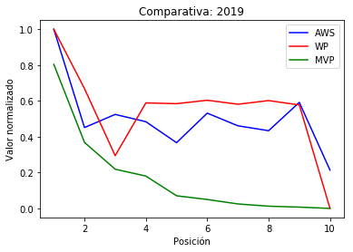

## Evaluacion comparativa entre AWS y WP

La información de las votaciones de los distintos premios obtenida en premios.py nos servirá para evaluar las medidas AWS y WP. Para compararlas evaluaremos el TOP de jugadores siguiente diferentes citerios y veremos qué medida da mejores resultados en base a diferentes métricas. 

El premio más importante de la temporada es el MVP (Most Valuable Player), se otorga todos los años al final de la temporada regular por votación. Esta votación es realizada por 125 miembros; 3 votos por cada equipo de la NBA, y 35 periodistas y analistas especializados de medios de comunicación. Cada uno de los miembros vota cinco jugadores, dando diez puntos al primer puesto, siete al segundo, cinco al tercero, tres al cuarto y uno al quinto. 

Se tendrán en cuenta tanto el número de jugadores que están nominados al MVP y no aparecen en el TOP30 de la medida como la posición que ocupan en la votación, siendo especialmente importante el número de veces que éstos han sido votados en primer puesto.

Por ejemplo, en 2018 vemos: 

* En el TOP30 de AWS hay 11 de los 13 nominados al MVP, mientras que en el TOP30 de WP están todos los jugadores que han recibido votos. 
* Los jugadores que no aparecen en el TOP30 de AWS son DeMar DeRozan y LaMarcus Aldridge, quedando respectivamente 8º y 9º en la votación.

En vista de los resultados podemos concluir que ambas variables tienen un desempeño muy similar, habrá que esperar al modelado para ver cual explica mejor el resultado del partido, pero podemos afirmar que ambas dan como mejores jugadores valores esperables y lógicos. En la siguiente tabla comparamos los mejores jugadores según los diferentes criterios.

También vemos un desequilibrio sorprendente en los jugadores con sueldos mayores y los nominados al MVP, así como entre los sueldos y los TOP30 de las medidas que hemos calculado.

Comparamos finalmente las puntuaciones de las diferentes variables normalizadas para los jugadores más votados al MVP:

### Conclusiones

Ambas variables han probado su efectividad para evaluar el desempeño individual de los jugadores. 

En vista de las últimas gráficas, WP parece seguir más adecuadamente el orden de las votaciones al mejor jugador del MVP, ya que los cambios del signo de la pendiente de la curva son menos y menos bruscos.

