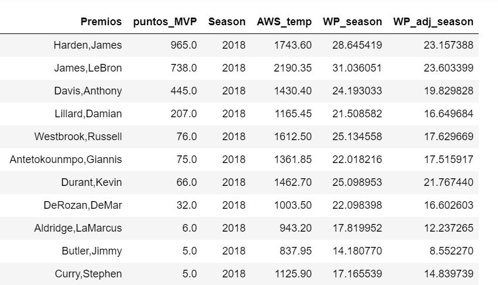

## Evaluacion de AWS y WP

La información de las votaciones de los distintos premios obtenida en premios.py nos servirá para evaluar las medidas AWS y WP. Para compararlas evaluaremos el TOP de jugadores siguiente diferentes citerios y si los resultados que obtenemos coinciden con lo esperable.

El premio más importante de la temporada es el MVP (Most Valuable Player), se otorga todos los años al final de la temporada regular por votación. Esta votación es realizada por 125 miembros; 3 votos por cada equipo de la NBA, y 35 periodistas y analistas especializados de medios de comunicación. Cada uno de los miembros vota cinco jugadores, dando diez puntos al primer puesto, siete al segundo, cinco al tercero, tres al cuarto y uno al quinto. 

Se tendrán en cuenta tanto el número de jugadores que están nominados al MVP y no aparecen en el TOP30 de la medida como la posición que ocupan en la votación, siendo especialmente importante el número de veces que éstos han sido votados en primer puesto.

Por ejemplo, en 2018 vemos: 

* En el TOP30 de AWS hay 11 de los 13 nominados al MVP, mientras que en el TOP30 de WP están todos los jugadores que han recibido votos. 
* Los jugadores que no aparecen en el TOP30 de AWS son DeMar DeRozan y LaMarcus Aldridge, quedando respectivamente 8º y 9º en la votación.

En vista de los resultados podemos concluir que ambas variables tienen un desempeño muy similar, habrá que esperar al modelado para ver cual explica mejor el resultado del partido, pero podemos afirmar que ambas dan como mejores jugadores valores esperables y lógicos. En la siguiente tabla comparamos los mejores jugadores según los diferentes criterios.

También vemos un desequilibrio sorprendente en los jugadores con sueldos mayores y los nominados al MVP, así como entre los sueldos y los TOP30 de las medidas que hemos calculado.

### Conclusiones

En un vistazo rápido vemos, por ejemplo, que dos de las mayores discrepancias en la ordenación del TOP de cada medida en 2018 son Stephen Curry y Kevin Durant, teniendo estos un peor resultado en las votaciones para MVP que siguiendo nuestras métricas. Estos jugadores son las dos estrellas del equipo campeón en esa temporada, Golden State Warriors, es decir, le podemos dar ventaja al criterio de AWS / WP frente al resultado de la votación. 

En conclusión, hemos conseguido un criterio para evaluar el desempeño de los jugadores mejor que los criterios existentes, liberando este análisis de los percepciones subjetivas y simpatías personales. Evaluaremos la media de cada equipo de estas variables antes del partido en el modelo, utilizando estas métricas como rating de la plantilla de cada equipo. 

